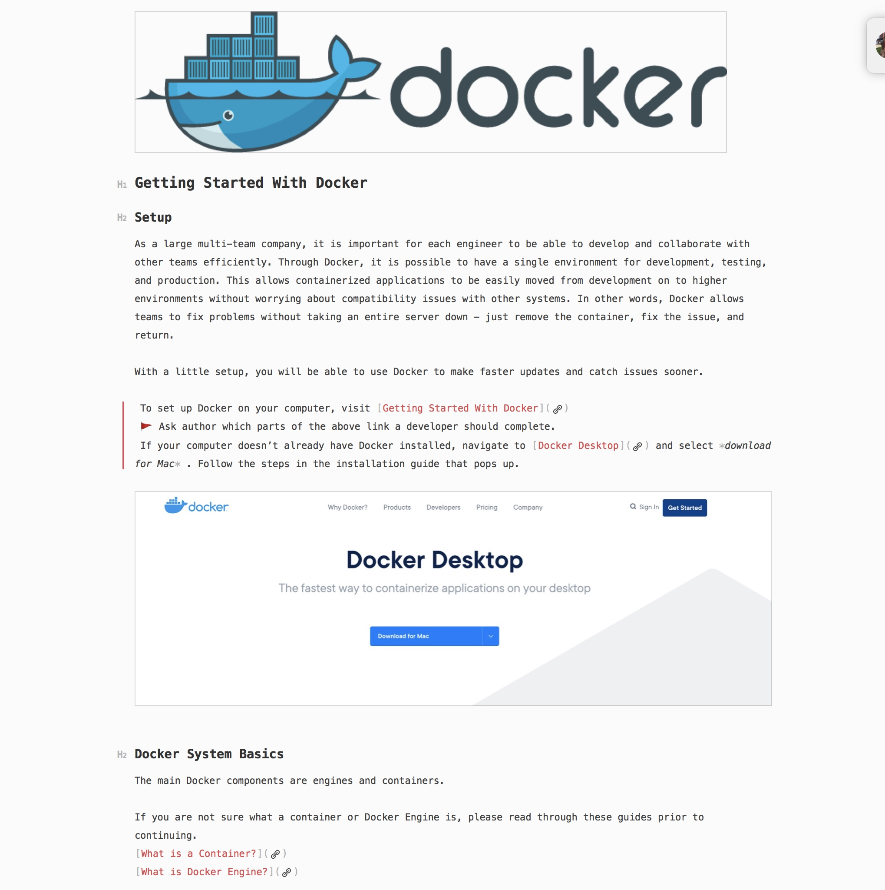

## How Do I Look?
Picture this, your friend (we'll call them Jordan) is preparing to go to a private networking event downtown. Jordan is hoping to secure an investor for their firm and has enlisted your help to ensure that the outfit they choose is appropriate. After putting on the selected piece, they spin around slowly - offering you a chance to see any imperfections or flaws in the outfit before you draw a conclusion. In the end, you suggest that Jordan switch out the blue shoes for black ones and remove the blazer. 

This same approach is how I go about editing. Upon recieving a piece of writing, I try to envision the author as my friend asking about their wardrobe choices. This helps me put the author's vision first and center any additions, withdrawals, and changes around their voice. Follow along with me as I walk you through my process for transforming an unimaginitive list of thoughts into a well dressed blog post. 

## Dressing Up For Docker
Please note that I cannot make further edits on the company's Confluence page (where the document lives). 
All edits have been created using *Bear*, a plain text editor. 

 

#### This is our starting point.  
>

### Initial Thoughts
At first read, I am delighted to see that the author has well defined categories of points and that each of the bullets are complete thoughts. Since I know that this post will be part of an educational blog for new hires at the company, I also have enough information to form an angle.  

From here, I can start to focus in on the structure of the post.  

### Creating Order
We know that this blog is being used for onboarding purposes, which means that the *Get Started and Tutorials* section should be moved to the top, followed by *What is the Docker Engine*. This places *What is a Container?* at the end of the document, since it is repeating information and may be deleted later on. The reference section will be placed to the side for the time being. 

#### This is our first edit.
> 

### Building Structure
Now that the text is in easily identifiable chunks, it is time to zone in on the individual sections and start to create a more meaningful structure. Currently, each heading has its own sub-heading. Unfortunately, the subheadings are not generating any support for the main headings and as such, should be removed.

Next, let's take a look at the links at the top of each category. Although it will be necessary for the reader to follow these links, there is no real context surrounding them. For now, we will move the links out of the main body of text and into the references section that has been set aside - making sure to note which section each link belonged to. 

As this is meant to be blog post for new hires to follow along with (as opposed to a checklist), we will also remove the bullet point lists. 

#### This is our second edit.
>

### Creating Paragraphs
Wow! Even without editing the actual content, the piece already looks more put together. Now that we have a clear structure in place, we can start moving the individual sentences into a paragraph format within each section. This is also where we will highlight the angle of the piece. At the moment, I am not concerned with how the sentences or paragraphs flow together. I will address that shortly. 

I believe that the first point in the *Getting Started and Tutorials* section would make a great lead so I am going to highlight it for easy reference at a later step in my editing process. 

After moving individual sentences around a bit and selecting the lead, we can do another read through and take note of what me might think of for the content edit. I will be adding a "to-do" flag and a note after any areas I would like to revist. 

It looks a bit messy, but fear not! The next step in the process is where all the heavy editing takes place and where we can start to create a bit more *flow*. 

#### This is our third edit. 
> 

### Increasing Readability
For this part of the process, I will be reading through the entire post and adding in transitions, intros, and the references we removed earlier on. If I notice that something could be added, I will add it in as a suggestion to the author. 

> 
#### This is our fourth edit.

### Copy Edit
It has come time to do another read through - from beginning to end. This time, I am checking for inconsistencies, unnecessary repetition, punctuation, and grammar. This is the final edit before sending the annotated version to the author for review. 

### Final Touches
